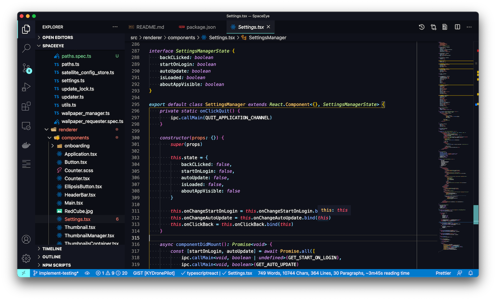

# Material Deep Ocean Theme

VSCode theme based on the [Material Theme
Plugin](https://www.material-theme.com)'s _Deep Ocean_ theme for JetBrains IDEs.

## Installing

This theme can be installed from the [VSCode Marketplace].

## Notice a problem?

This theme is still early in its development and some languages are supported
better than others. If you notice any problems, please [create an
issue](https://github.com/KYDronePilot/material-deep-ocean-theme/issues). Since
this is a different platform then IntelliJ, there are unfortunately some aspects
of the original theme that can't be replicated.
